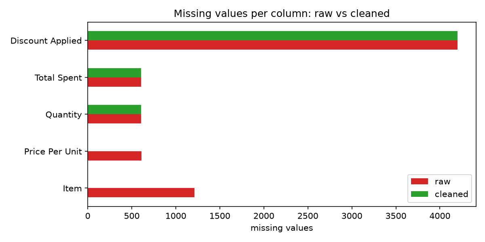

# Retail Data Cleaning Pipeline

A tested Python pipeline that cleans the Kaggle [Retail Store Sales (Dirty)](https://www.kaggle.com/datasets/ahmedmohamed2003/retail-store-sales-dirty-for-data-cleaning)
dataset — recovering **1,822 missing values deterministically** instead of dropping rows.



## The problem

The raw dataset (12,575 rows × 11 columns) ships with deliberate quality issues:

1. **Discount Applied**: 4,199 values missing (33%)
2. **Item**: 1,213 missing (~10%)
3. **Price Per Unit / Quantity / Total Spent**: ~600 missing each
4. **Transaction Date**: stored as strings, not dates
5. **Discount Applied**: stored as generic objects, not booleans

## The approach

Instead of deleting incomplete rows, the pipeline exploits relationships
*within* the data:

- **Equation-based recovery**: `Total Spent = Quantity × Price Per Unit` holds
  exactly wherever all three values exist — so any one can be reconstructed
  from the other two.
- **Lookup-based recovery**: exploration proved every (Category, Price Per Unit)
  pair maps to exactly one Item, making missing Items recoverable with certainty.
- **Honest missingness**: the 33% of unknown discounts are converted to a
  nullable boolean and *kept* as NA — imputing them would fabricate data.
  Analysis showed Quantity and Total Spent are only ever missing jointly
  (604 rows), making equation-based recovery impossible there; these are
  documented rather than guessed.

Every step logs what it changed, producing a cleaning report on each run.

## Results

| Issue | Outcome |
|---|---|
| Missing prices | 609 / 609 recoverable values restored |
| Missing items | 1,213 / 1,213 restored (100%) |
| Dates | converted to datetime, 0 unparseable |
| Discounts | typed as nullable boolean, 4,199 NA deliberately kept |
| Duplicates | 0 found (verified) |

## How to run

```bash
pip install -r requirements.txt

# run the pipeline
python -m src.run_cleaning data/raw/retail_store_sales.csv data/processed/clean.parquet -v

# run the tests (7)
pytest
```

The raw CSV is not committed; download it from the
[Kaggle dataset page](https://www.kaggle.com/datasets/ahmedmohamed2003/retail-store-sales-dirty-for-data-cleaning)
and place it at `data/raw/retail_store_sales.csv`.

## Project structure

```
retail-data-cleaning/
├── data/
│   ├── raw/          # original CSV (gitignored)
│   └── processed/    # cleaned parquet output (gitignored)
├── docs/             # charts used in this README
├── notebooks/
│   ├── 01_exploration.ipynb   # data quality analysis
│   └── 02_analysis.ipynb      # before/after charts and findings
├── src/
│   ├── cleaning.py            # cleaning functions + pipeline
│   └── run_cleaning.py        # CLI entry point
├── tests/
│   └── test_cleaning.py       # pytest suite
└── requirements.txt
```

## Data source

[Retail Store Sales: Dirty for Data Cleaning](https://www.kaggle.com/datasets/ahmedmohamed2003/retail-store-sales-dirty-for-data-cleaning)
by Ahmed Mohamed, released under CC BY-SA 4.0.